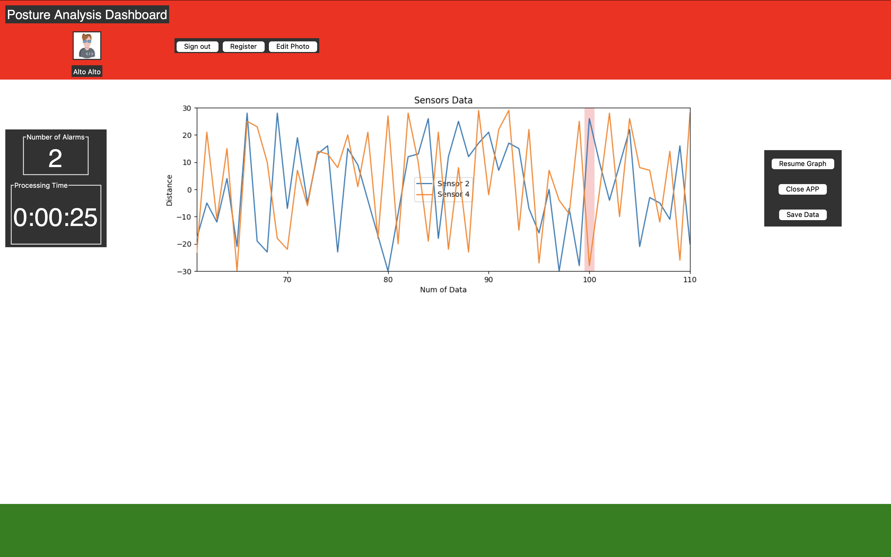

# Sensor Monitoring Dashboard
This is a Tkinter-based application that allows users to monitor sensor data and detect potential alarms. The application provides a graphical user interface (GUI) where users can view real-time sensor data, detect anomalies, and manage user accounts.

## Features
### 1. Show multiple lines on one graph with legends (DONE)
The application can display multiple sensor data streams on a single graph, with corresponding legends for easy identification.
### 2. Create alarm detection and show it on the graph (DONE)
The application can detect anomalies in the sensor data and display them on the graph.
### 3. Add time to determine processing time (DONE)
The application can measure the processing time for various operations, such as data retrieval and alarm detection.
### 4. Change position of the buttons and the graph (DONE)
The application allows users to customize the layout of the GUI, including the positioning of the buttons and the graph.
### 5. Create a simple database for storing user data (DONE)
The application uses a simple database to store user information, such as login credentials and sensor data.
### 6. Add data retrieve method (DONE)
The application provides a method to retrieve sensor data from the database.
### 7. Add sign-in/sign-out methods (DONE)
The application includes sign-in and sign-out functionality, allowing users to securely access their data.
### 8. Add background color of the alarm detected (DONE)
The application displays a distinctive background color when an alarm is detected on the graph.
### 9. Fix image display (DONE)
The application can now properly display images.
### 10. Improve the design (TODO)
The application's design can be further improved to enhance the user experience.
### 11. Add password encryption (DONE)
The application should encrypt user passwords for better security.
### 12. Code Refactoring (TODO)
The codebase can be refactored to improve readability, maintainability, and code organization.
### 13. User reports (TODO, Altair)
Add reports generating fuction, including: user used the device for (duration), alarm generated during (local time), etc. So that user can understand their postural behavior.
### 14. Data cleaning (Xijun is working on this)
Replace extream values with the last value. And add low-pass filter(if needed).
### 15. Alarm date and time recording (TODO)
Alarm generated at XX:XX AM/PM, dd-mm-yy. Lasted for XX mins. 
### 16. New Data Entry upon Registration (DONE)
The app requests and store more data, such as age, gender, weight, height, and shoulder size [XL, L, M, S, XS]
### 17. Pause monitoring (TODO)
User have the choice to Pause Monitoring for X mins.
### 18. Neutral and Extreme Posture Data collection (TODO)
After a new user has created a profile, give Instruction: Please make two posture(1.round shoulder with extream poking chin, 2. normal shoulder with neck extention) at 3 different distances(65/70/80cm), one by one. User should stay still at each posture for at least 10s. Data will be used to culculate individual fleibility. 
### 19. General Setting (TODO)
1.User may be able to set how frequent they want to be notified. "I want to be notified if I maintained a bad posture for 3/5/10/X mins."
2. User can set if they want alarm sound or mute device. Sound enable:'!s1#', Sound disable:'!s0#'.

## Installation and Usage
### 1. Clone the repository:
``` git clone https://github.com/AltaJD/PostureResearchProject/tree/master/gui```
### 2. Install the required dependencies:
```pip install -r requirements.txt```
### 3. Run the application:
```python main.py```
## Contributing
We welcome contributions to the project. If you find any issues or have ideas for improvements, please feel free to create a new issue or submit a pull request.
